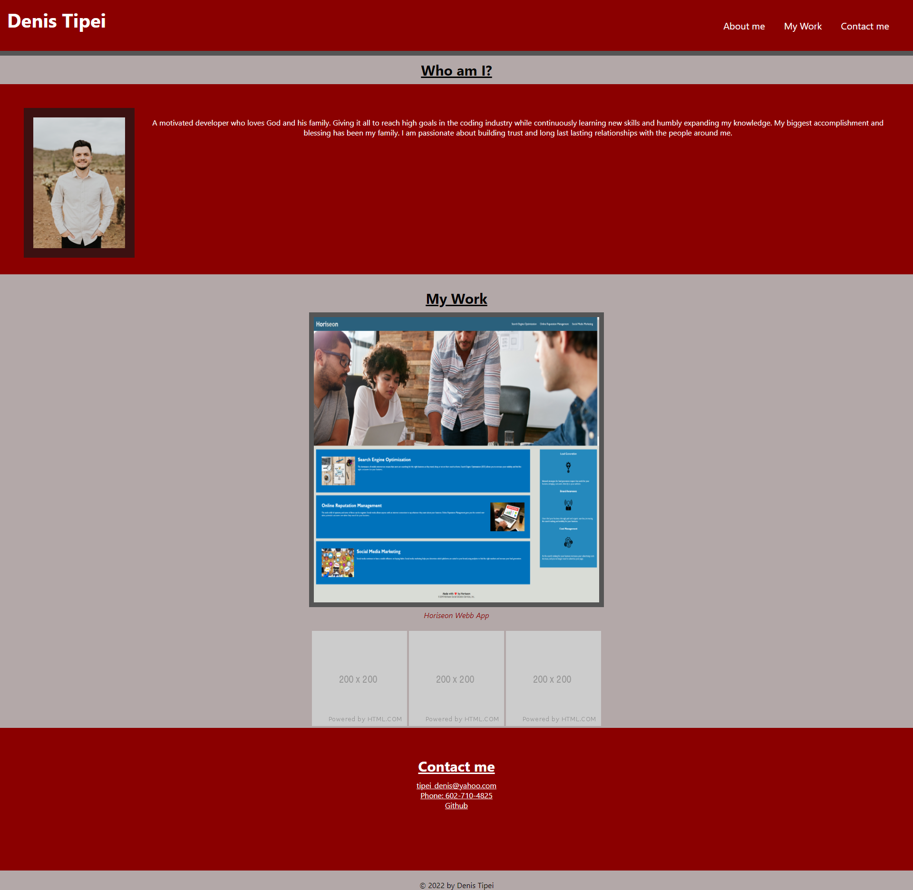

# module-2-challenge

### Description
* created html and css files to a potential employee's portfolio page
* portfolio page loads and shows developer's name, photo and a "contact me" section
* used html to create the skeleton of the page and then used css to style the page
* created links to the nav bar that lead to each section that it corresponds to
* linked developer's first web application to the portfolio
* when screen gets smaller there's a responsive layout that adapts

### Screenshot

### Link
[module2challenge](https://dvtipei.github.io/module-2-challenge/)